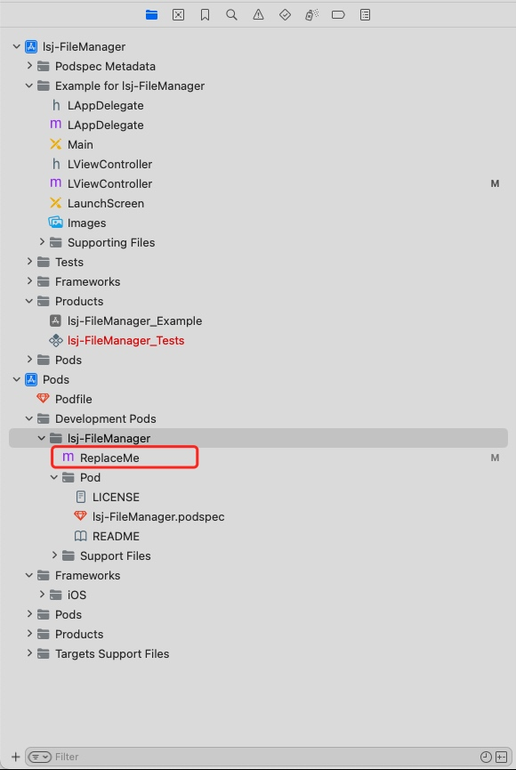
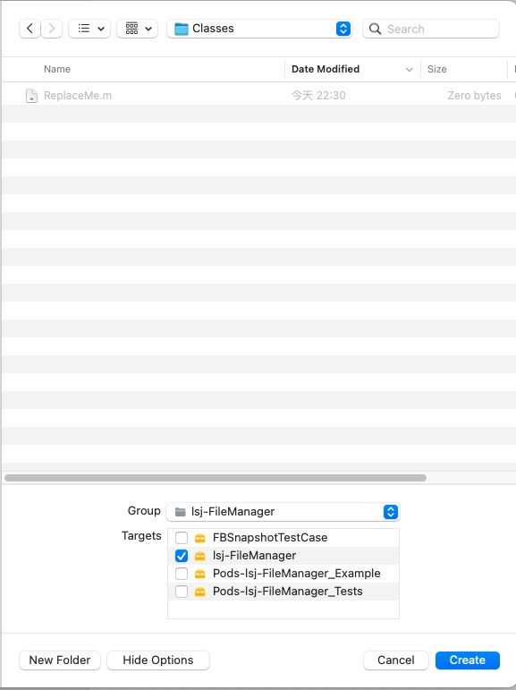
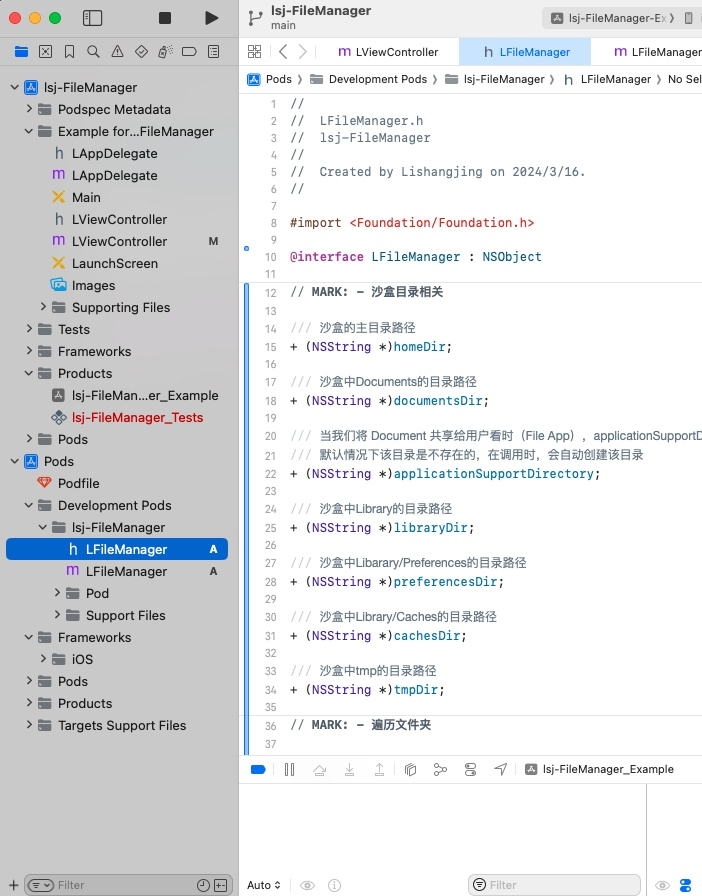
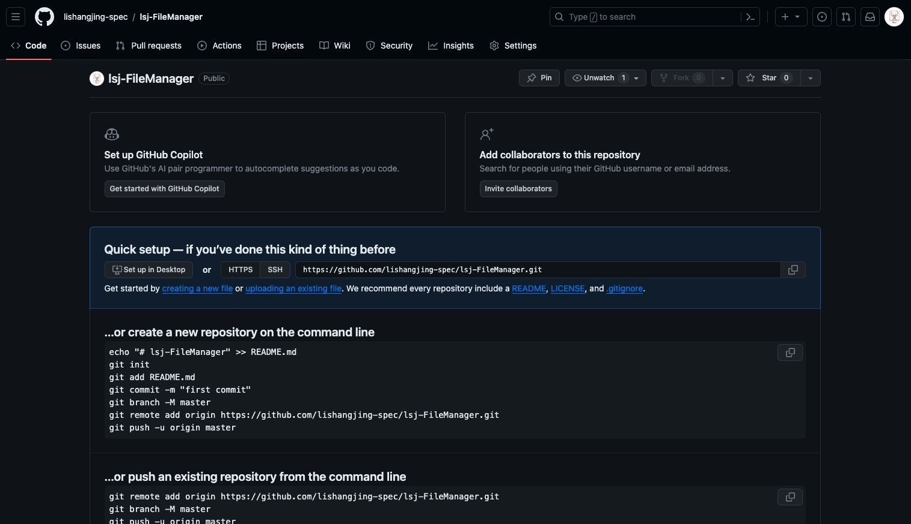
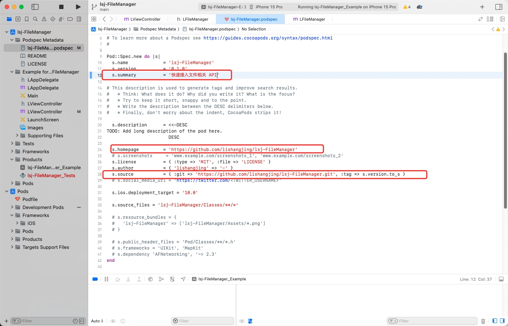
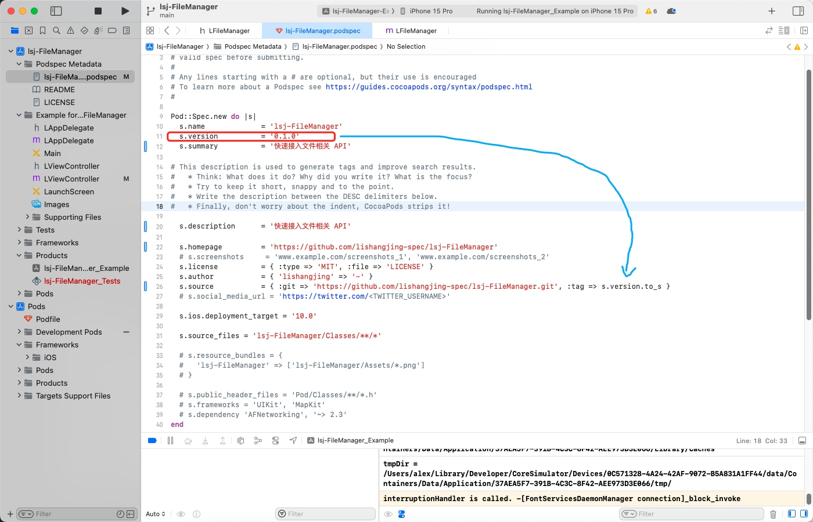

# lsj-cocoapodsTest
Cocoapods 各种场景测试


CocoaPods 版本：1.15.2
芯片：Apple M1 Pro


## 公开的 Cocoapods 仓库创建（开源仓库）

这个场景，我们是为了提供给所有人更加便捷的集成我们的封装好的东西。

创建的方式，官网也有介绍：https://guides.cocoapods.org/

**Input:**

通过命令 `pod lib create 你的仓库名称` 创建仓库，我这里以 `lsj-FileManager` 作为我的仓库名称

```Shell
pod lib create lsj-FileManager
```

**Output：使用的平台**

```Shell
What platform do you want to use?? [ iOS / macOS ]
```

**Input:**

```Shell
iOS
```

**Output：选择语言**

```Shell
What language do you want to use?? [ Swift / ObjC ]
```

**Input:**

```Shell
ObjC
```

**Output：是否创建演示应用程序Demo**

```Shell
Would you like to include a demo application with your library? [ Yes / No ]
```

**Input:**

```Shell
Yes
```

**Output：您将使用哪些测试框架？**

```Shell
Which testing frameworks will you use? [ Specta / Kiwi / None ]
```

**Input: 我个人认为 Xcode 的 XCTest 挺好的，后续也可以自己加入对应的 XCTest Target**

```Shell
None
```

**Output：需要创建 UI 测试，后续也可以自行加入 Target**

```Shell
Would you like to do view based testing? [ Yes / No ]
```

**Input: 是否要进行基于视图的测试？**

```Shell
Yes
```

**Output：设置工程文件的前缀，这个根据自己的代码规范填写**

```Shell
What is your class prefix?
```

**Input:**

```Shell
L
```

**Output：**

```Shell
Running pod install on your new library.

Analyzing dependencies
Downloading dependencies
Installing FBSnapshotTestCase (2.1.4)
Installing lsj-FileManager (0.1.0)
Generating Pods project
Integrating client project

[!] Please close any current Xcode sessions and use `lsj-FileManager.xcworkspace` for this project from now on.
Pod installation complete! There are 2 dependencies from the Podfile and 2 total pods installed.


[!] Your project does not explicitly specify the CocoaPods master specs repo. Since CDN is now used as the default, you may safely remove it from your repos directory via `pod repo remove master`. To suppress this warning please add `warn_for_unused_master_specs_repo => false` to your Podfile.

 Ace! you're ready to go!
 We will start you off by opening your project in Xcode
  open 'lsj-FileManager/Example/lsj-FileManager.xcworkspace'

To learn more about the template see `https://github.com/CocoaPods/pod-template.git`.
To learn more about creating a new pod, see `https://guides.cocoapods.org/making/making-a-cocoapod`.
```

---

> 到这里，仓库已经创建好了，终端会打开你的项目


## 在仓库中，添加我们的代码

在工程的`Pods/Development/Pods/lsj-FileManager/`目录下，有一个 `ReplaceMe` 文件，
是存放我们文件的位置，不能直接在 `lsj-FileManager` 右键 `new->File`，
因为这是一个虚拟路径，需要我们手动导航进入 `Classes` 目录中，
可以通过右键 `ReplaceMe` 文件 `Show In Finder`，进入到 `Classes` ，获取路径

|  |  |  |
|---|---|---|

## 在 Example 中去使用它，Example 项目安装你的pod，提供给用户使用 Demo

**Input：进入 Example 目录，Pod install**

```Shell
cd Example 
pod install
```

**Output：**
```Shell
Analyzing dependencies
Downloading dependencies
Installing lsj-FileManager 0.1.0
Generating Pods project
Integrating client project
Pod installation complete! There are 2 dependencies from the Podfile and 2 total pods installed.
```

## 创建 Git 仓库（备用，后续填入 .podspec 文件中的 `source` 字段中）



## 校验我们的 .podspec 文件

**Input：**

```Shell
pod lib lint lsj-FileManager.podspec
```

**Output：summary: The summary is not meaningful 需要我们完善 summary**

```Shell
-> lsj-FileManager (0.1.0)
    - WARN  | summary: The summary is not meaningful.
    - NOTE  | url: The URL (https://github.com/lishangjing/lsj-FileManager) is not reachable.
    - NOTE  | xcodebuild:  note: Using codesigning identity override: -
    - NOTE  | [iOS] xcodebuild:  note: Building targets in dependency order
    - NOTE  | [iOS] xcodebuild:  note: Target dependency graph (3 targets)
    - NOTE  | [iOS] xcodebuild:  note: Signing static framework with --generate-pre-encrypt-hashes (in target 'Pods-App' from project 'Pods')
    - NOTE  | [iOS] xcodebuild:  /var/folders/cs/08c4rp4s4_l39wwhn08jt3sc0000gn/T/CocoaPods-Lint-20240317-8175-8r0xaa-lsj-FileManager/App.xcodeproj: warning: The iOS Simulator deployment target 'IPHONEOS_DEPLOYMENT_TARGET' is set to 10.0, but the range of supported deployment target versions is 12.0 to 17.0.99. (in target 'App' from project 'App')
    - NOTE  | [iOS] xcodebuild:  Pods.xcodeproj: warning: The iOS Simulator deployment target 'IPHONEOS_DEPLOYMENT_TARGET' is set to 10.0, but the range of supported deployment target versions is 12.0 to 17.0.99. (in target 'Pods-App' from project 'Pods')
    - NOTE  | [iOS] xcodebuild:  Pods.xcodeproj: warning: The iOS Simulator deployment target 'IPHONEOS_DEPLOYMENT_TARGET' is set to 10.0, but the range of supported deployment target versions is 12.0 to 17.0.99. (in target 'lsj-FileManager' from project 'Pods')

[!] lsj-FileManager did not pass validation, due to 1 warning (but you can use `--allow-warnings` to ignore it).
You can use the `--no-clean` option to inspect any issue.
```


## 完善 .podspec 文件中的 s.summary 、 s.description

 

**Input:**

```Shell
pod lib lint lsj-FileManager.podspec
```

**Output：lsj-FileManager passed validation. 校验通过**

``` Shell
 -> lsj-FileManager (0.1.0)
    - NOTE  | xcodebuild:  note: Using codesigning identity override: -
    - NOTE  | [iOS] xcodebuild:  note: Building targets in dependency order
    - NOTE  | [iOS] xcodebuild:  note: Target dependency graph (3 targets)
    - NOTE  | [iOS] xcodebuild:  note: Signing static framework with --generate-pre-encrypt-hashes (in target 'Pods-App' from project 'Pods')
    - NOTE  | [iOS] xcodebuild:  Pods.xcodeproj: warning: The iOS Simulator deployment target 'IPHONEOS_DEPLOYMENT_TARGET' is set to 10.0, but the range of supported deployment target versions is 12.0 to 17.0.99. (in target 'Pods-App' from project 'Pods')
    - NOTE  | [iOS] xcodebuild:  /var/folders/cs/08c4rp4s4_l39wwhn08jt3sc0000gn/T/CocoaPods-Lint-20240317-8554-8ralh0-lsj-FileManager/App.xcodeproj: warning: The iOS Simulator deployment target 'IPHONEOS_DEPLOYMENT_TARGET' is set to 10.0, but the range of supported deployment target versions is 12.0 to 17.0.99. (in target 'App' from project 'App')
    - NOTE  | [iOS] xcodebuild:  Pods.xcodeproj: warning: The iOS Simulator deployment target 'IPHONEOS_DEPLOYMENT_TARGET' is set to 10.0, but the range of supported deployment target versions is 12.0 to 17.0.99. (in target 'lsj-FileManager' from project 'Pods')

lsj-FileManager passed validation.
```

## 推送仓库代码到 Git

``` Shell
# 进如项目根目录
git init
git add .
git commit -m 'Initial Commit'
git remote add origin https://github.com/lishangjing-spec/lsj-FileManager.git
git branch -M master
git push -u origin master
```

## 在 .podspec 文件中我们可以看到

```Shell
s.source = { :git => 'https://github.com/lishangjing-spec/lsj-FileManager.git', :tag => s.version.to_s }
```

这里指的是，我们依赖的下载地址是：
`https://github.com/lishangjing-spec/lsj-FileManager.git`
同时，指向的是：`s.version` `tag`
在 `.podspec` 中 `s.version = 0.1.0` 

这是默认的设置，我们可以自行更改，也可以遵循这个规则

## 遵循规则，给我们最新的commit打上tag，让仓库能引用到我们的代码
**Input：**
```Shell
git tag 0.1.0
git push origin 0.1.0
```

**Output：**

```Shell
Total 0 (delta 0), reused 0 (delta 0), pack-reused 0
To github.com:lishangjing-spec/lsj-FileManager.git
 * [new tag]         0.1.0 -> 0.1.0
```

## 推送项目到 Cocoapods

**Input：**

```Shell
pod trunk push lsj-FileManager.podspec
```

**Output：**

```Shell
Updating spec repo `trunk`
Validating podspec
 -> lsj-FileManager
    - NOTE  | xcodebuild:  note: Using codesigning identity override: -
    - NOTE  | [iOS] xcodebuild:  note: Building targets in dependency order
    - NOTE  | [iOS] xcodebuild:  note: Target dependency graph (3 targets)
    - NOTE  | [iOS] xcodebuild:  note: Signing static framework with --generate-pre-encrypt-hashes (in target 'Pods-App' from project 'Pods')
    - NOTE  | [iOS] xcodebuild:  Pods.xcodeproj: warning: The iOS Simulator deployment target 'IPHONEOS_DEPLOYMENT_TARGET' is set to 10.0, but the range of supported deployment target versions is 12.0 to 17.0.99. (in target 'Pods-App' from project 'Pods')
    - NOTE  | [iOS] xcodebuild:  /var/folders/cs/08c4rp4s4_l39wwhn08jt3sc0000gn/T/CocoaPods-Lint-20240317-16091-pb1xlo-lsj-FileManager/App.xcodeproj: warning: The iOS Simulator deployment target 'IPHONEOS_DEPLOYMENT_TARGET' is set to 10.0, but the range of supported deployment target versions is 12.0 to 17.0.99. (in target 'App' from project 'App')
    - NOTE  | [iOS] xcodebuild:  Pods.xcodeproj: warning: The iOS Simulator deployment target 'IPHONEOS_DEPLOYMENT_TARGET' is set to 10.0, but the range of supported deployment target versions is 12.0 to 17.0.99. (in target 'lsj-FileManager' from project 'Pods')

Updating spec repo `trunk`

--------------------------------------------------------------------------------
 🎉  Congrats

 🚀  lsj-FileManager (0.1.0) successfully published
 📅  March 17th, 08:27
 🌎  https://cocoapods.org/pods/lsj-FileManager
 👍  Tell your friends!
```

> 上传完成


## [F&A]

### [!] Authentication token is invalid or unverified. Either verify it with the email that was sent or register a new session.

首次上传或过久没上传，需要重新注册

**Input：**

```Shell
# 接受 Cocoapods 的邮箱，以及你的名称（例如：帅哥）
pod trunk register 'xxx@qq.com' 'Name'
```

**Output：进入邮箱，找到并打开验证链接**
```Shell
[!] Please verify the session by clicking the link in the verification email that has been sent to xxx@qq.com
```

**Input：**

```Shell
pod trunk push XXXXX.podspec
```

---

### .podspec 文件的属性介绍

* s.name：名称
* s.version：版本号
* s.summary：总结
* s.description：描述
* s.homepage：仓库主页（作用于用户访问仓库首页）
* s.license：开源协议
* s.author：作者
* s.source：用户pod时，依赖拉取的地址
* s.ios.deployment_target：依赖支持的版本号
* s.source_files：项目文件路径
* s.resource_bundles：项目资源文件路径
* s.dependency：项目绑定的其他三方依赖
* s.frameworks：项目绑定的系统 Framework

